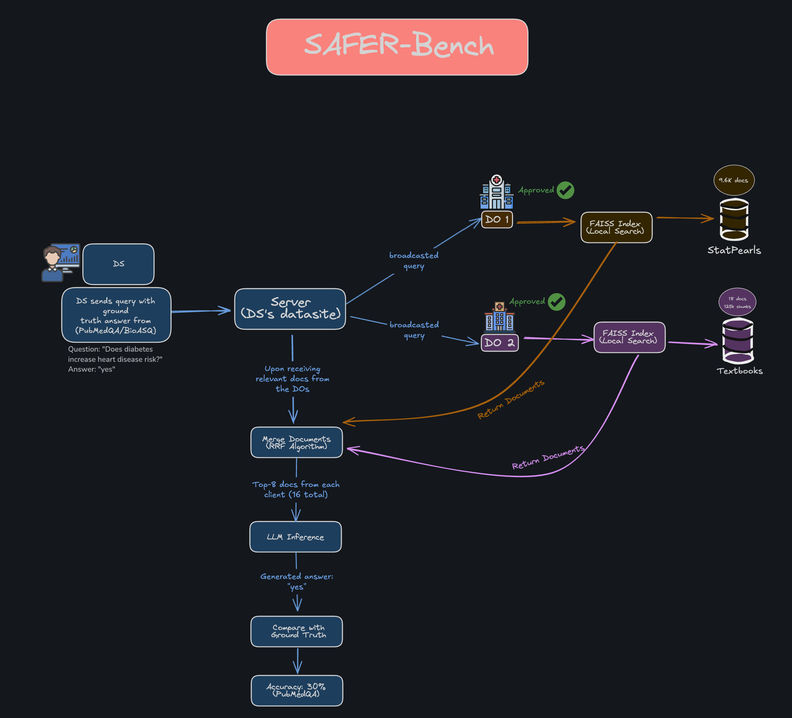

# SAFER-Bench

SAFER-Bench is a comprehensive benchmark framework for evaluating Federated Retrieval-Augmented Generation (RAG) systems with approval-based privacy controls. It enables systematic evaluation of retrieval algorithms, merging strategies, LLMs, and privacy mechanisms in realistic federated settings where Data Owners (DOs) maintain control over their data.



## Benchmarked Models

| Model | Size | Type | Config |
|-------|------|------|--------|
| SmolLM2-1.7B-Instruct | 1.7B | General | `smollm_1.7b.yaml` |
| BioMistral-7B | 7B | Medical | `biomistral_7b.yaml` |
| Mistral-7B-Instruct-v0.3 | 7B | General | `mistral_7b_instruct.yaml` |
| OpenBioLLM-Llama3-70B (GGUF Q5_K_M) | 70B | Medical | `openbiollm_70b_gguf.yaml` |
| Llama-3.3-70B-Instruct (GGUF Q5_K_M) | 70B | General | `llama3.3_70b_gguf.yaml` |

**Note**: 70B models use GGUF quantization (Q5_K_M) for reduced memory footprint (~50GB) with Metal GPU acceleration on Apple Silicon.

## Prerequisites

- Python 3.12+
- [uv](https://docs.astral.sh/uv/) (Python package manager)
- [just](https://github.com/casey/just) (command runner)

## Setup

1. Clone the repository and install dependencies:
```bash
git clone <repo-url>
cd safer-bench
uv sync
```

2. Download datasets by running the notebook `datasets/dataset_download.ipynb`:
```python
# Downloads from https://huggingface.co/datasets/khoaguin/medical-corpus
# Available corpora: statpearls, textbooks
```

## Running Benchmarks

Use `just` commands to run benchmarks. Run `just` to see all available commands.

### Quick Start (Subset Mode)

For development and quick iteration with data subsets:
```bash
# Default: separated_2do federation with smollm_1.7b
just run-dry

# Specify federation and LLM
just run-dry federation=hybrid_2do llm=biomistral_7b
```

### Full Benchmark (Production Mode)

For complete benchmarks with full datasets:
```bash
# Default configuration
just run

# Specify federation and LLM
just run federation=centralized_1do llm=mistral_7b_instruct

# With 70B models (requires ~52GB RAM)
just run federation=separated_2do llm=openbiollm_70b_gguf
```

### Run All Federations

```bash
# Subset mode (fast)
just run-all-federations-dry llm=biomistral_7b

# Full mode (long-running)
just run-all-federations llm=biomistral_7b
```

### Debug Mode (Keep Artifacts)

```bash
# Keep directories for inspection
just run-dry-inspect
just run-inspect
```

### Available Options

**Federation configs**: `separated_2do`, `hybrid_2do`, `hybrid_3do`, `hybrid_4do`, `centralized_1do`

**LLM configs**: `smollm_1.7b`, `biomistral_7b`, `mistral_7b_instruct`, `openbiollm_70b_gguf`, `llama3.3_70b_gguf`

**Privacy configs**: `none`, `dp_0.1`, `dp_1.0`

### Cleanup

```bash
just clean         # Clean running artifacts and caches
just clean-output  # Clean output directories
```