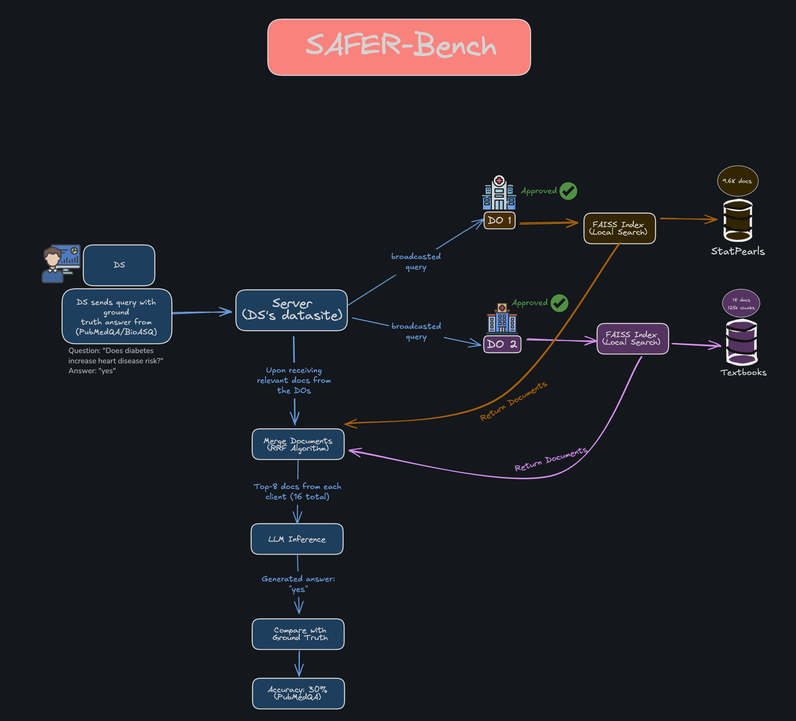

# SAFER-Bench

SAFER-Bench is a comprehensive benchmark framework for evaluating Federated Retrieval-Augmented Generation (RAG) systems with approval-based privacy controls. It enables systematic evaluation of retrieval algorithms, merging strategies, LLMs, and privacy mechanisms in realistic federated settings where Data Owners (DOs) maintain control over their data.

<p align="center">
  
</p>

## Federation Configurations

Federation configs define how data is distributed across Data Owners (DOs). All configs use three corpora: **StatPearls**, **Textbooks**, and **MIMIC-IV-Note**.

| Config | DOs | Distribution | Description |
|--------|-----|--------------|-------------|
| `centralized_1do` | 1 | Centralized | Baseline: single DO holds all datasets (StatPearls + Textbooks + MIMIC-IV-Note) |
| `separated_3do` | 3 | Partitioned | Each DO holds one complete dataset (DO1: StatPearls, DO2: Textbooks, DO3: MIMIC-IV-Note) |
| `hybrid_2do` | 2 | Hybrid | Each DO holds 50% of all three datasets |
| `hybrid_3do` | 3 | Hybrid | Each DO holds ~33% of all three datasets |
| `hybrid_4do` | 4 | Hybrid | Each DO holds 25% of all three datasets |
| `specialty_7do` | 7 | Specialty | Each DO holds clinical notes from one medical specialty (MIMIC-IV-Note only) |

### Distribution Strategies

- **Centralized**: Non-federated baseline for comparison. All data in one location.
- **Separated/Partitioned**: Each DO specializes in one corpus. Simulates domain-specific data silos.
- **Hybrid**: Data distributed evenly across DOs. Simulates collaborative networks with shared data types.
- **Specialty**: Each DO holds clinical notes from a single medical specialty (Cardiology, Oncology, Neurology, Pulmonology, Gastroenterology, Nephrology, General). Simulates real-world healthcare institutions with specialty-specific records.

## Benchmarked Components

### LLMs

| Model | Size | Type | Config |
|-------|------|------|--------|
| SmolLM2-1.7B-Instruct | 1.7B | General | `smollm_1.7b.yaml` |
| BioMistral-7B | 7B | Medical | `biomistral_7b.yaml` |
| Mistral-7B-Instruct-v0.3 | 7B | General | `mistral_7b_instruct.yaml` |
| OpenBioLLM-Llama3-70B (GGUF Q5_K_M) | 70B | Medical | `openbiollm_70b_gguf.yaml` |
| Llama-3.3-70B-Instruct (GGUF Q5_K_M) | 70B | General | `llama3.3_70b_gguf.yaml` |

**Note**: 70B models use GGUF quantization (Q5_K_M) for reduced memory footprint (~50GB) with Metal GPU acceleration on Apple Silicon.

### Retrievers

| Retriever | Type | Config | Description |
|-----------|------|--------|-------------|
| FAISS IVF | Dense | `faiss_ivf.yaml` | Dense vector retrieval (default) |
| FAISS HNSW | Dense | `faiss_hnsw.yaml` | Dense retrieval with HNSW index |
| BM25 | Sparse | `bm25.yaml` | Sparse retrieval (k1=1.2, b=0.75) |
| Hybrid | Dense+Sparse | `hybrid.yaml` | Fusion of dense and sparse (alpha=0.5) |

### Merging Strategies

| Strategy | Config | Description |
|----------|--------|-------------|
| Reciprocal Rank Fusion | `rrf.yaml` | RRF with k=60 (default) |
| Weighted RRF | `weighted_rrf.yaml` | RRF with per-source weights |
| Borda Count | `borda.yaml` | Position-based voting |
| CombMNZ | `combmnz.yaml` | Rewards multi-source consensus |
| CombSUM | `combsum.yaml` | Sum of normalized scores |

### Privacy Mechanisms

| Privacy | Config | Description |
|---------|--------|-------------|
| None | `none.yaml` | No privacy protection (default) |
| DP (epsilon=1.0) | `dp_1.0.yaml` | Differential privacy, Gaussian mechanism |
| DP (epsilon=0.1) | `dp_0.1.yaml` | Strong differential privacy, Gaussian mechanism |

### QA Datasets

Benchmarks run against 5 medical QA datasets (100 questions each by default):

| Dataset | Description |
|---------|-------------|
| PubMedQA | Biomedical literature Q&A |
| BioASQ | Biomedical semantic indexing and Q&A |
| MMLU Medical | Medical subset of MMLU |
| MedQA (US) | US medical licensing exam questions |
| MedMCQA | Medical multiple-choice Q&A |

## Prerequisites

- Python 3.12+
- [uv](https://docs.astral.sh/uv/) (Python package manager)
- [just](https://github.com/casey/just) (command runner)

## Setup

1. Clone the repository and install dependencies:
```bash
git clone <repo-url>
cd safer-bench
uv sync
```

2. Download datasets by running the notebook `datasets/dataset_download.ipynb`:
```python
# Downloads from https://huggingface.co/datasets/khoaguin/medical-corpus
# Available corpora: statpearls, textbooks
```

## Running Benchmarks

Use `just` commands to run benchmarks. Run `just` to see all available commands.

### Quick Start (Subset Mode)

For development and quick iteration with data subsets:
```bash
# Default: separated_3do federation with smollm_1.7b
just run-dry

# Specify federation and LLM
just run-dry federation=hybrid_2do llm=biomistral_7b
```

### Full Benchmark (Production Mode)

For complete benchmarks with full datasets:
```bash
# Default configuration
just run

# Specify federation and LLM
just run federation=centralized_1do llm=mistral_7b_instruct

# With 70B models (requires ~52GB RAM)
just run federation=separated_3do llm=openbiollm_70b_gguf

# With differential privacy
just run federation=separated_3do llm=biomistral_7b privacy=dp_1.0

# No-retrieval baseline (LLM-only, no RAG context)
just run federation=separated_3do llm=biomistral_7b retrieval.enabled=false
```

### Run All Federations

```bash
# Subset mode (fast)
just run-all-federations-dry llm=biomistral_7b

# Full mode (long-running)
just run-all-federations llm=biomistral_7b

# With privacy
just run-all-federations llm=biomistral_7b privacy=dp_1.0
```

### Debug Mode (Keep Artifacts)

```bash
# Keep directories for inspection
just run-dry-inspect
just run-inspect
```

### Cleanup

```bash
just clean         # Clean running artifacts and caches
just clean-output  # Clean output directories
```

### Specialty-Based Benchmarks (MIMIC-IV-Note)

Specialty-based distribution partitions clinical notes by medical specialty, modeling real-world healthcare institutions.

**1. Generate specialty mapping (one-time prerequisite):**
```bash
just generate-specialty-mapping              # Both subset and full
just generate-specialty-mapping --subset-only
just generate-specialty-mapping --full-only
```

**2. Run specialty benchmark:**
```bash
# Quick test (subset, 2 questions)
just run-dry federation=specialty_7do llm=smollm_1.7b

# Full benchmark
just run federation=specialty_7do llm=biomistral_7b
```

**Medical Specialties:**
| DO | Specialty | Description |
|----|-----------|-------------|
| DO1 | Cardiology | Heart and cardiovascular conditions |
| DO2 | Oncology | Cancer and tumor-related cases |
| DO3 | Neurology | Brain and nervous system disorders |
| DO4 | Pulmonology | Lung and respiratory conditions |
| DO5 | Gastroenterology | Digestive system disorders |
| DO6 | Nephrology | Kidney and renal conditions |
| DO7 | General | Infectious diseases and miscellaneous |

See `docs/plans/specialty_based_distribution.md` for implementation details.

## Metrics & Tracking

### Evaluation Metrics

- **Accuracy**: Overall, per-dataset, per-option (A/B/C/D), confusion matrix
- **Efficiency**: Per-query timing breakdown (retrieval, merge, generation), throughput (queries/second)
- **Privacy-utility tradeoff**: Accuracy drop with approval rate, DO participation rate
- **Federation**: Per-DO contribution, data source diversity, communication time/ratio

### MLflow Tracking

Experiment results are tracked via MLflow. By default, each run creates a local MLflow tracking directory in the output folder. Configure in `configs/config.yaml`:

```yaml
mlflow:
  enabled: true
  tracking_uri: "auto"
  experiment_name: "SaferBench"
```
